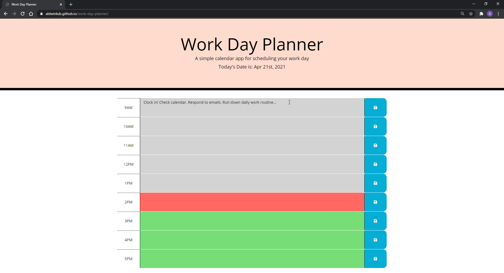
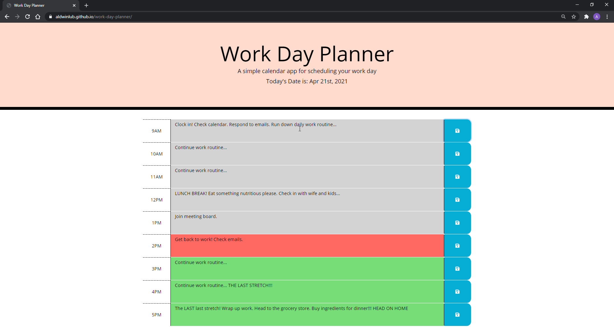

# work-day-planner

## Overview:

This work day planner lets the user insert their 'plans' whilst saving the text that they entered through a save button. This is achieved by using the localStorage variable and the setItem and getItem methods. The actual save button was created with the help of bootstrap, font awesome, and the prebuilt style.css file.

With the implementation of moment.js, the website displays the current date while also being responsive through the different colors of the text areas depending on the time. If it is currently 2PM, the planner highlights the 2PM row as red, the rows before 2PM are higlighted grey, and, finally, the rows after 2PM are highlighted green.

## Link to GitHub Pages:

https://aldwinlub.github.io/work-day-planner/

## Screenshots!

The initial look of the Work Day Planner once it is first loaded:

I added to the planner, clicked the save button, and refreshed the page:

I completed the planner with plans, saved the text, and refreshed the page:

